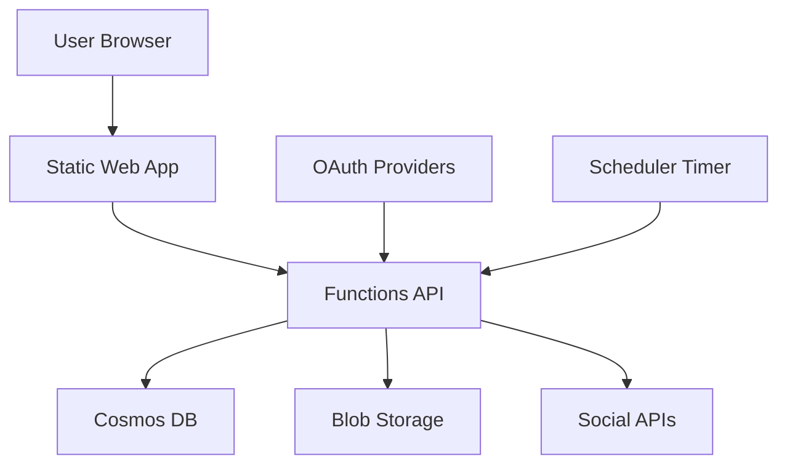

## Executive summary
Postline is a React + Azure Functions social-posting app with strongest risk around OAuth account-linking integrity, media confidentiality, and outbound URL handling. The highest-value abuse paths are in `api/src/functions/accounts.js` (unauthenticated callback state trust), `api/src/services/blob.js` + `scripts/azure/provision.sh` (public blob access despite desired restricted media), and publisher flows that fetch user-controlled `mediaUrl` (`api/src/services/social/twitter.js`, `api/src/services/social/linkedin.js`). Restricted B2C and single-user deployment lower broad internet abuse likelihood, but do not remove risks from account compromise, misconfiguration, or exposed callback surfaces.

## Scope and assumptions
In-scope paths:
- `api/src/functions/*`
- `api/src/middleware/*`
- `api/src/services/*`
- `client/src/context/AuthContext.jsx`
- `client/src/services/*`
- `scripts/azure/*`
- `README.md`
- `staticwebapp.config.json`

Out-of-scope:
- UI styling/components not affecting security behavior (`client/src/components/*`, most `client/src/pages/*`)
- Minified build artifacts in `client/dist/*`
- External platform internals (Meta/X/LinkedIn APIs)

Assumptions (validated with user input):
- Current state is dev/non-public; target is production-ready personal deployment.
- B2C is restricted (not open self-service internet signups) and deployment is single-user oriented.
- Media confidentiality is a requirement; public-by-default media URLs are not acceptable.
- Azure-hosted production path follows repo scripts (`scripts/azure/provision.sh`, `scripts/azure/configure.sh`, `scripts/azure/deploy.sh`).

Open questions that could materially change ranking:
- Will this ever support multi-user/tenant operation, or remain strictly single-user?
- Will OAuth callback and token exchange in `accounts.js` be replaced before production (current code is stub-like)?
- Will outbound egress restrictions (VNet, firewall rules) be applied for Function App?

## System model
### Primary components
- Browser SPA (`client/src/main.jsx`, `client/src/App.jsx`) authenticates through MSAL/B2C (`client/src/services/authConfig.js`) and sends bearer tokens via Axios interceptor (`client/src/services/api.js`).
- Azure Functions API exposes HTTP routes for posts, media, accounts, and publish; all routes are declared `authLevel: 'anonymous'` and rely on `requireAuth` except OAuth callback (`api/src/functions/*.js`, `api/src/middleware/auth.js`).
- Timer-trigger scheduler (`api/src/functions/scheduler.js`) publishes due posts every minute.
- Cosmos DB stores posts and social account records, including OAuth tokens (`api/src/services/cosmos.js`, `api/src/functions/accounts.js`).
- Blob Storage stores uploaded media; media container is created with public blob access (`api/src/services/blob.js`).
- External social APIs are called from server-side publishers (`api/src/services/social/*.js`).

### Data flows and trust boundaries
- User browser -> Static Web App frontend
  - Data: user interaction, post content, local media file.
  - Channel: HTTPS.
  - Security guarantees: browser TLS; route protection in SPA (`ProtectedRoute` in `client/src/App.jsx`).
  - Validation: mostly client-side UX checks only.
- Frontend -> Azure Functions HTTP API
  - Data: bearer token, JSON payloads (`posts`), multipart upload (`media`), account actions.
  - Channel: HTTPS REST.
  - Security guarantees: JWT verification in `requireAuth` (`api/src/middleware/auth.js`), Function CORS set to app origin in deploy script (`scripts/azure/configure.sh`).
  - Validation: limited server-side validation; no schema enforcement in `posts.js`/`media.js`.
- OAuth provider -> `/api/accounts/callback/{platform}`
  - Data: OAuth `code`, `state`.
  - Channel: HTTPS redirect callback.
  - Security guarantees: currently none at endpoint auth layer (`accountCallback` has no `requireAuth` in `api/src/functions/accounts.js`).
  - Validation: checks only presence of `code` and `state`; trusts `state` as `userId`.
- API -> Cosmos DB
  - Data: posts, schedules, connected account records, tokens.
  - Channel: SDK over TLS (`@azure/cosmos`).
  - Security guarantees: account key auth from environment; partition key by `/userId` for app-level separation (`scripts/azure/provision.sh`, `api/src/services/cosmos.js`).
  - Validation: app-level ownership checks in handlers; no token encryption at app layer.
- API -> Blob Storage
  - Data: uploaded file bytes and metadata; returned public URL.
  - Channel: SDK over TLS (`@azure/storage-blob`).
  - Security guarantees: storage account credentials in app settings.
  - Validation: no MIME/extension allowlist, no size limits, no malware scanning; container created with `access: 'blob'`.
- API/Scheduler -> External social APIs
  - Data: post content, media URL, OAuth access token.
  - Channel: outbound HTTPS `fetch`.
  - Security guarantees: provider token-based auth.
  - Validation: platform-specific checks only; Twitter/LinkedIn helper fetches `post.mediaUrl` directly server-side.

#### Diagram

## Assets and security objectives
| Asset | Why it matters | Security objective (C/I/A) |
|---|---|---|
| OAuth/social access tokens (`socialAccounts.accessToken`) | Enables posting as user on external platforms | C, I |
| Post content and scheduling state (`posts` container) | Unauthorized changes can publish wrong content or cause reputational harm | I, A |
| Uploaded media files | User requires restricted access; leaks can expose private assets | C |
| B2C identity claims (`oid/sub`) | Binds operations to owner identity | I |
| Cosmos DB account key and Blob connection string | Compromise gives broad datastore/media control | C, I, A |
| Function execution budget and scheduler throughput | Abuse can create cost spikes and missed publishes | A |
| Audit/error logs | Needed for incident triage and abuse detection | I, A |

## Attacker model
### Capabilities
- Internet attacker can reach public Function HTTP endpoints once deployed.
- Authenticated attacker with a valid restricted B2C token can call all authenticated API routes.
- Attacker can send crafted JSON/multipart payloads and trigger publish/scheduler paths.
- Attacker can hit OAuth callback endpoints without prior API auth.
- If owner account/session is compromised, attacker can act as full app user.

### Non-capabilities
- No assumed direct shell access to Azure Functions host.
- No assumed compromise of Azure control plane by default.
- No assumed break of B2C JWT signatures.
- No assumed multi-tenant cross-user targeting in intended single-user deployment, except where endpoint logic itself allows spoofing.

## Entry points and attack surfaces
| Surface | How reached | Trust boundary | Notes | Evidence (repo path / symbol) |
|---|---|---|---|---|
| `GET/POST /api/accounts/callback/{platform}` | OAuth redirect or direct HTTP call | Internet -> Functions API | Accepts `code` + `state`, no `requireAuth`; stores record using `state` as `userId` | `api/src/functions/accounts.js` `accountCallback` |
| `GET /api/accounts/connect/{platform}` | Authenticated API call | Browser -> Functions API | Builds OAuth URLs; uses static Twitter PKCE challenge | `api/src/functions/accounts.js` `connectAccount` |
| `POST /api/media` | Authenticated multipart upload | Browser -> Functions API | No file size/type enforcement before Blob upload | `api/src/functions/media.js` `uploadMedia` |
| `POST /api/posts`, `PUT /api/posts/{id}` | Authenticated JSON | Browser -> Functions API | Accepts caller-controlled `mediaUrl`, `status`, `scheduledAt` | `api/src/functions/posts.js` `createPost`/`updatePost` |
| `POST /api/posts/{id}/publish` | Authenticated API call | Browser -> Functions API -> Social APIs | Triggers outbound provider calls with stored tokens | `api/src/functions/publish.js` `publishPost` |
| Timer scheduler | Azure timer every minute | Platform -> Functions runtime | Queries all due scheduled posts and fan-out publishes | `api/src/functions/scheduler.js` `app.timer('scheduler')` |
| JWT auth middleware | Called by most handlers | API auth boundary | Validates token with JWKS; audience bound to env `B2C_CLIENT_ID` | `api/src/middleware/auth.js` `requireAuth`/`authenticateRequest` |
| Blob container access model | Provisioning and runtime creation | API -> Storage | Public blob access enabled in infra and container create | `scripts/azure/provision.sh`, `api/src/services/blob.js` |

## Top abuse paths
### AP-01: OAuth callback account-binding forgery
1. Attacker calls `/api/accounts/callback/{platform}` directly with crafted `state=<targetUserId>` and attacker-controlled `code`.
2. Endpoint accepts unauthenticated request, persists social account row for that `userId`.
3. Victim account linkage is corrupted; publish actions may post as attacker account or fail persistently.
4. Impact: integrity loss of account bindings, potential external-account takeover in real token-exchange implementation.

### AP-02: Public media confidentiality break
1. Authenticated user uploads sensitive media through `/api/media`.
2. Blob container and object are public; URL is returned and can be shared/guessed/logged.
3. Anyone with URL retrieves media without authorization.
4. Impact: confidentiality breach against stated requirement that media be restricted.

### AP-03: SSRF through server-side media fetch in publishers
1. Authenticated attacker sets `mediaUrl` in post to internal or metadata endpoint.
2. Publishing flow executes `fetch(mediaUrl)` in Twitter/LinkedIn upload helper.
3. Function app performs outbound request to attacker-chosen target.
4. Impact: internal network probing, metadata/token exposure risk, or pivot to protected services.

### AP-04: Storage/compute DoS via unbounded uploads and schedules
1. Attacker repeatedly uploads large files and creates many scheduled posts.
2. No explicit upload size/type quotas or request rate controls block the abuse.
3. Scheduler runs every minute and attempts broad due-post fan-out to social APIs.
4. Impact: cost increase, delayed legitimate publishes, and possible throttling/outage.

### AP-05: Token-at-rest exposure cascade
1. Attacker gains read access to Cosmos data or app settings through misconfiguration/insider compromise.
2. OAuth tokens and infra credentials are directly usable (plaintext in records/settings).
3. Attacker publishes as user, modifies data, or exfiltrates media/content.
4. Impact: full confidentiality/integrity compromise across app and linked social accounts.

### AP-06: JWT audience misconfiguration acceptance
1. Deployment misses `B2C_CLIENT_ID` or sets wrong value.
2. Middleware continues running without startup guardrail, relying on issuer/signature checks only.
3. Tokens for unintended audiences in the same tenant may be accepted.
4. Impact: unauthorized API access despite valid-signature tokens.

## Threat model table
| Threat ID | Threat source | Prerequisites | Threat action | Impact | Impacted assets | Existing controls (evidence) | Gaps | Recommended mitigations | Detection ideas | Likelihood | Impact severity | Priority |
|---|---|---|---|---|---|---|---|---|---|---|---|---|
| TM-001 | Internet attacker | Callback endpoint reachable; attacker can send crafted query params. | Forge OAuth callback `state`/`code` to bind wrong social account to user. | Account-link integrity compromise; potential posting-as-attacker in production token flow. | OAuth tokens, account linkage integrity | `connectAccount` route is authenticated (`requireAuth`) and platform allowlist exists (`accounts.js`). | `accountCallback` has no auth/session binding; trusts `state` as `userId`; no CSRF nonce/PKCE verifier validation. | Replace `state=userId` with signed, short-lived nonce bound to logged-in session; store verifier server-side; require callback-to-session correlation; reject unknown/expired states; implement real token exchange with provider validation. | Alert on callback failures/success spikes per IP; log state nonce ID (not raw token/code); detect account relinks outside normal user session. | Medium | High | high |
| TM-002 | Authenticated attacker (or compromised owner session) | Valid API token; ability to create/update post with arbitrary `mediaUrl`; publish path executed. | Use internal URL in `mediaUrl` to force server-side fetch from Function runtime. | SSRF to internal services/metadata; possible credential leakage or network reconnaissance. | Infra credentials, network boundary, availability | Auth required for create/update/publish (`posts.js`, `publish.js`). | No URL scheme/host validation; no private-IP blocklist; no egress restrictions in code. | Enforce strict media origin allowlist (own blob domain + trusted CDN), block private/link-local IPs and non-HTTPS, add fetch timeout/size caps, and deploy egress controls. | Log outbound fetch host/IP and failures; alert on non-allowlisted hosts and metadata IP probes. | Medium | High | high |
| TM-003 | Authenticated attacker, accidental leak, or URL recipient | Upload capability and possession of blob URL. | Access supposedly private media through public blob URL. | Confidential media exposure; requirement mismatch for production. | Uploaded media confidentiality | Auth required to upload (`media.js`), TLS to storage SDK. | Container created public (`access: 'blob'`); infra enables blob public access; no short-lived signed URLs. | Set storage account `allow-blob-public-access false`; create private container; return short-lived SAS for read; scrub media URLs from verbose logs/errors. | Monitor anonymous blob reads and unusual geographic access; alert on public ACL drift. | High | Medium | high |
| TM-004 | Authenticated attacker or automation bug | Valid token and ability to submit many uploads/posts. | Flood uploads/schedules; trigger frequent publish fan-out and external API calls. | Cost increase, scheduler backlog, degraded publish reliability. | Compute/storage budget, publish availability | Scheduler isolated in timer trigger and logs failures (`scheduler.js`). | No API rate limits, no per-user quotas, no upload size cap, no scheduler concurrency/backpressure controls. | Add per-user/IP rate limiting at gateway; enforce max upload size/type; cap scheduled posts and publish batch size; implement queue with retries/dead-letter instead of tight loop. | Alert on request rate, upload bytes, due-post backlog, and publish failure ratio trends. | Medium | Medium | medium |
| TM-005 | Insider/cloud misconfig attacker | Read access to Cosmos records or Function app settings. | Extract stored social tokens and infra secrets for downstream abuse. | Unauthorized social posting, data exfiltration, service compromise. | OAuth tokens, Cosmos/Blob credentials, post data | Secrets loaded from env; Azure-managed services used (`cosmos.js`, `blob.js`). | Tokens stored plaintext in `socialAccounts`; no envelope encryption/key vault usage for app secrets. | Store OAuth tokens encrypted (app-level encryption + key rotation in Key Vault), minimize token retention, prefer managed identity over long-lived account keys. | Detect Cosmos reads on token-bearing documents, app-setting access changes, and key regeneration events. | Low | High | medium |
| TM-006 | Misconfiguration / token holder in same tenant | `B2C_CLIENT_ID` missing or incorrect at deploy time. | Present valid-issuer token with unintended audience to API. | Unauthorized API access by wrong client app principals. | API auth boundary, post/media integrity | JWT signature + issuer checks exist (`auth.js`). | No startup hard-fail for missing `B2C_CLIENT_ID`; implicit reliance on environment correctness. | Fail fast at startup when auth env vars are absent; add explicit audience assertion tests in health/startup checks; add deployment policy guardrails. | Emit startup configuration audit event and alert when auth config is incomplete. | Low | High | medium |

## Criticality calibration
Critical for this repo/context means likely compromise of external account control, private media confidentiality, or full app control with little attacker friction.
- Example 1: unauthenticated OAuth callback forgery that can bind attacker account to owner identity and enable posting as owner.
- Example 2: direct extraction of all social tokens plus Cosmos/Blob credentials from compromised config path.

High means realistic abuse with meaningful security/business impact but requiring authenticated access or partial preconditions.
- Example 1: SSRF via server-side media fetch to cloud metadata/internal endpoints.
- Example 2: media confidentiality failure from public blobs in a deployment that requires restricted media.
- Example 3: cross-boundary misuse that causes unauthorized publishes or persistent integrity corruption.

Medium means exploitable weaknesses that are impactful but constrained by single-user deployment, restricted B2C, or stronger prerequisites.
- Example 1: scheduler and upload DoS causing cost/performance issues.
- Example 2: JWT audience misconfiguration acceptance requiring deployment error plus valid tenant token.
- Example 3: token-at-rest exposure that depends on separate infrastructure access failure.

Low means minor leakage/noise issues with limited security consequence in the stated single-user restricted-B2C model.
- Example 1: non-sensitive error verbosity without secret leakage.
- Example 2: endpoint misuse that only affects attacker-owned data and is easily reversible.

## Focus paths for security review
| Path | Why it matters | Related Threat IDs |
|---|---|---|
| `api/src/functions/accounts.js` | OAuth initiation/callback flow, state handling, and account-link persistence are core integrity risks. | TM-001 |
| `api/src/middleware/auth.js` | Central auth gate; env-driven JWT verification logic controls all protected routes. | TM-006 |
| `api/src/functions/media.js` | Upload entry point currently lacks strict file constraints and quota controls. | TM-003, TM-004 |
| `api/src/services/blob.js` | Explicitly sets public blob access at container creation; key media confidentiality control point. | TM-003 |
| `scripts/azure/provision.sh` | Infrastructure defaults currently enable public blob access. | TM-003 |
| `api/src/functions/posts.js` | Accepts caller-controlled `mediaUrl`, schedule fields, and status transitions. | TM-002, TM-004 |
| `api/src/functions/publish.js` | Fan-out publish path and error handling influence abuse impact and observability. | TM-002, TM-004 |
| `api/src/services/social/twitter.js` | Performs server-side fetch of user-controlled media URL before upload. | TM-002 |
| `api/src/services/social/linkedin.js` | Performs server-side fetch of user-controlled media URL before upload. | TM-002 |
| `api/src/functions/scheduler.js` | Unbounded due-post query loop can amplify DoS and cost. | TM-004 |
| `api/src/services/cosmos.js` | Data-layer operations and token-at-rest handling tie to credential and integrity risk. | TM-005 |
| `scripts/azure/configure.sh` | Deployment-time secret injection and CORS/auth config guardrails. | TM-005, TM-006 |

## Quality check
- Entry points covered: all HTTP handlers and timer trigger discovered via `app.http`/`app.timer` are represented.
- Trust boundaries covered in threats: browser->API, OAuth provider->callback, API->storage/db/social APIs each map to at least one threat.
- Runtime vs dev/CI separation: model focuses on runtime paths; deployment scripts included only where they change production security posture.
- User clarifications incorporated: non-public/dev current state, restricted B2C, single-user intent, and media-restricted requirement all reflected in prioritization.
- Assumptions and open questions are explicit and attached to risk ranking.
