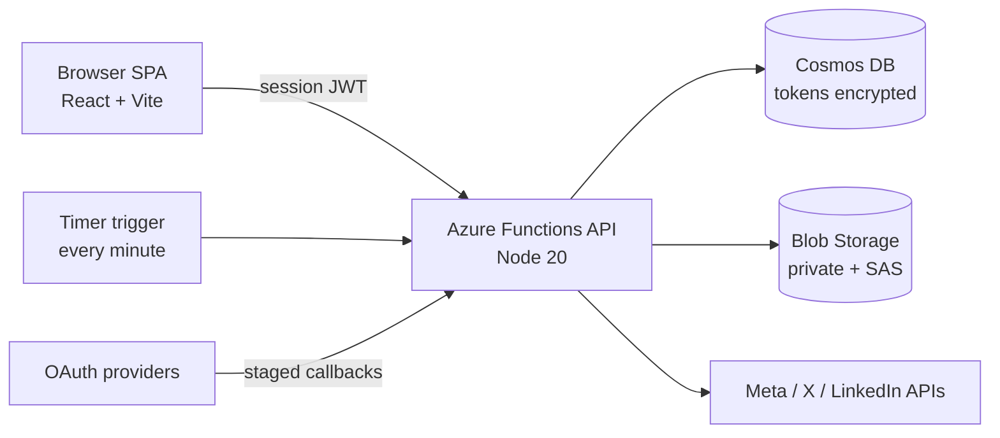

# Postline

**Self-hosted social media scheduler.** Deploy your own copy, add your own platform keys, and compose, preview, schedule, and publish posts to **Instagram, Facebook, X (Twitter), and LinkedIn** — from infrastructure you control, on Azure's free tiers (~$0–3/month for one user).

[](https://portal.azure.com/#create/Microsoft.Template/uri/https%3A%2F%2Fraw.githubusercontent.com%2Ftherightjon%2FPostline%2Fmain%2Finfra%2Fazuredeploy.json)

No SaaS, no per-seat pricing, no handing your social tokens to a third party: your tokens live encrypted in **your** database, and posts go out from **your** API.

## How it works

1. **Deploy** — the button above provisions everything (or use the [shell scripts](docs/deploy-azure.md)); pick your admin password at deploy time.
2. **Sign in** — password out of the box; optionally add [Google / Microsoft / GitHub / Facebook login](docs/login-providers.md).
3. **Add keys** — enable only the platforms you want by supplying their [developer app keys](docs/platform-publishing.md). Everything is optional and independent.
4. **Post** — compose once with per-platform previews and character counts, attach media, publish now or schedule; a built-in scheduler publishes due posts every minute.

## Features

- Multi-platform composer with live per-platform previews and character limits
- Drafts, scheduling calendar, immediate publish, per-platform success/failure tracking
- Media uploads to private blob storage, served via short-lived signed URLs
- Single-user by design: no signup surface, allowlist-gated optional social login
- Security first: scrypt password hashing + login rate limiting, AES-256-GCM-encrypted OAuth tokens at rest, SSRF-guarded outbound fetches, forgery-resistant OAuth callbacks, strict security headers — see [docs/security.md](docs/security.md) and the [threat model](Postline-threat-model.md)
- Runs on free tiers: Static Web Apps Free + Functions Consumption + Cosmos DB free tier

## Quickstart (local)

```bash
git clone https://github.com/therightjon/Postline.git
cd Postline
npm run install:all
./dev.sh
```

Open http://localhost:5173 → **Enter Dev Mode**. Zero configuration needed for the UI and a mock session; add Cosmos/Blob/platform keys as you go — see [docs/local-development.md](docs/local-development.md).

## Architecture



Two hosts: a **Static Web App (Free)** serves the SPA; a standalone **Consumption Function App** runs the API and the scheduler (SWA-managed functions can't run timer triggers). The client authenticates with a self-issued session JWT — password login by default, optional OIDC providers, all minting the same token.

## Documentation

| Doc | Contents |
|---|---|
| [docs/deploy-azure.md](docs/deploy-azure.md) | Deploy button, shell scripts, GitHub Actions, costs |
| [docs/local-development.md](docs/local-development.md) | dev.sh, dev bypass, docker-compose (experimental) |
| [docs/configuration.md](docs/configuration.md) | Every environment variable |
| [docs/platform-publishing.md](docs/platform-publishing.md) | Meta / X / LinkedIn app setup, scopes, review caveats |
| [docs/login-providers.md](docs/login-providers.md) | Optional Google / Microsoft / GitHub / Facebook sign-in |
| [docs/security.md](docs/security.md) | Security model and deliberate trade-offs |
| [docs/api.md](docs/api.md) | REST API reference and data model |

## Project structure

```
Postline/
├── client/                  # React + Vite SPA (pages, composer, previews, session auth)
├── api/                     # Azure Functions v4 (Node 20, ESM)
│   └── src/
│       ├── functions/       # auth, posts, media, accounts, publish, scheduler (timer)
│       ├── services/        # cosmos, blob, crypto (token encryption), mediaSecurity (SSRF),
│       │   │                #   password (scrypt), session (JWT), rateLimit, loginProviders
│       │   └── social/      # facebook, instagram, twitter, linkedin publishers + oauth exchange
│       └── middleware/      # session-token validation
├── infra/                   # main.bicep + compiled azuredeploy.json (deploy button)
├── scripts/                 # hash-password.mjs + azure/{provision,configure,deploy}.sh
├── .github/workflows/       # ci.yml, deploy.yml
├── docs/                    # documentation
└── docker-compose.yml       # experimental local stack
```

## Honest status

- The end-to-end app (auth, compose, schedule, media, scheduler) is functional and the security model is implemented and smoke-tested.
- The platform OAuth exchanges and publishers are written against each platform's documented APIs but **have not yet been exercised against live platform apps** — if you're an early deployer and hit a quirk, please open an issue.
- Per-platform content variants compose in the UI but only the shared text publishes today.
- docker-compose is experimental; `dev.sh` is the supported local path.

## License

MIT
